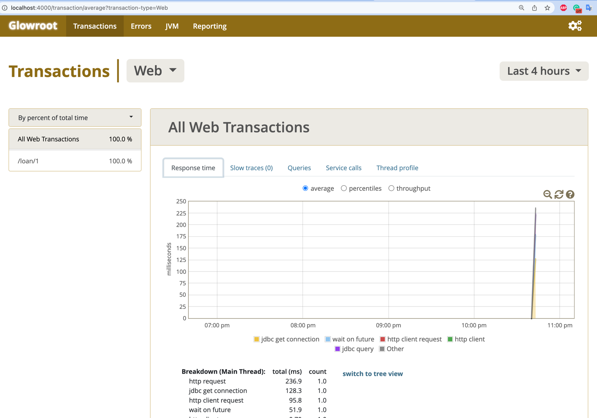
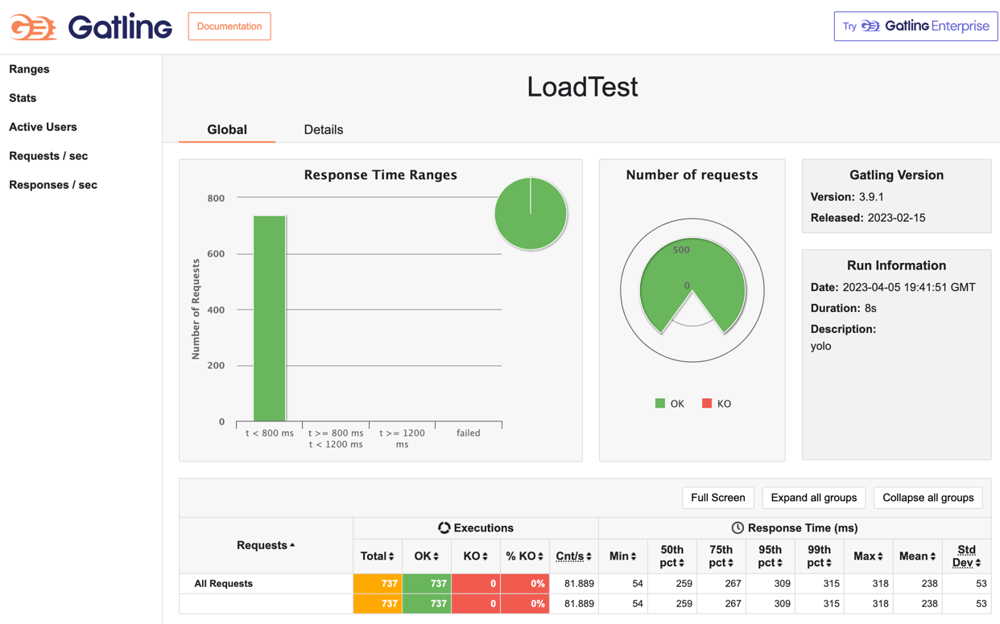

# Java Performance Profiling Workshop

## Setup

### Start a Database
- Start a standalone in-memory H2 database using `StartDatabase.java`.
- Connect to the database:
  - From IntelliJ Ultimate from application.properties file
  - After starting the app, directly at http://localhost:8080/h2-console 
    using (url = `jdbc:h2:tcp://localhost/~/test`, user=`sa`, password=`sa`)

### Add DB Latency
Run `StartDatabaseProxy.java` to simulate a network delay in talking to a remote DB.

### Start the Second Application
Run `SecondApp.java` to start a second application that will be called by the first one.

### Add Glowroot agent
Glowroot is a lightweight Java Agent that collects performance metrics and traces.
Download it from [glowroot.org](https://glowroot.org/).
Unzip the dist zip, and copy the path to the `glowroot.jar` in the root folder.

Add glowroot.jar to the 'VM option' field of your run configuration in IntelliJ:
`-javaagent:/path/to/glowroot.jar`.

After starting the application, you can access the Glowroot UI at http://localhost:4000. 
You should see a page like this:

### Add the open-telemetry agent (optional: requires local Docker)
- Start the monitoring-otel docker compose 
- Download the OTEL agent from [https://github.com/open-telemetry/opentelemetry-java-instrumentation/releases](here)
- Add to your VM options: `-javaagent:/path/to/opentelemetry-javaagent.jar -Dotel.instrumentation.micrometer.enabled=true -Dotel.metric.export.interval=500 -Dotel.bsp.schedule.delay=500`

## Start the application
Run `ProfiledApp.java` with the Glowroot agent.

## Run the load tests
Run `LoadTest.java` and click the report printed in the console at the end.
If successful, the generated HTML report should display a green bar like this:

Note: We are using an artificial 'closed' load test model:
(the number of users if fixed)

## See the flamegraph
Go to http://localhost:4000/transaction/thread-flame-graph?transaction-type=Web

## Optimization steps
1. Avoid useless network call from @Aspect
   - restTemplate.getForObject sometimes does not have to run: reorder lines
   - Observe: the time spent in the aspect is gone
2. Fix JDBC Connection Starvation issue:
   - Observe the Hikari getConnection time in the flamegraph
   - [Optional] increase Hikari connection pool size -> starvation fixed; UNDO
   - Make getLoanApplication not @Transactional -> no change :( 
   - Release the JDBC Connection earlier by `spring.jpa.open-in-view=false`
3. Lazy loading in toString
   - Observe: LoanApplication.toString performs a lazy load
   1) Use log.trace("... {}", loanApplication) instead of log.trace("..." + loanApplication)
   2) Fix the lazy load by manually creating a toString that does not include the collection fields/@ToString.Exclude
4. Fix the Apache HTTP Client connection pool
   - Observe: time is spent to acquire a connection from the Apache Http connection pool
   - Remove `feign.httpclient.max-connections-per-route` from application.properties

Import https://grafana.com/grafana/dashboards/19004-spring-boot-statistics/