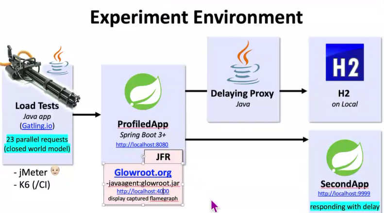

Steps:
   on
   https://github.com/victorrentea/performance-profiling
   Steps:
1) run StartDatabase.java
2) run StartDatabaseProxy.java = adds network latency between my local process and my local DB
3) run SecondApp.java
4) download
   https://github.com/glowroot/glowroot/releases/download/v0.14.0/glowroot-0.14.0-dist.zip
   unzip
   copy the path to glowroot.jar inside it
   eg: /Users/victorrentea/workspace/glowroot/glowroot.jar
   C:/down....../glowroot.jar
5) run ProfiledApp.java
   ! modify its run configuration to add VM args: -javaagent:<path-to-glowroot.jar>
   eg -javaagent:/Users/victorrentea/workspace/glowroot/glowroot.jar
   rerun ProfiledApp.java

6) run LoadTest.java

7) open the report in the console Flamegraph🔥🔥🔥 at http://localhost:4000/transaction/thread-flame-graph?transaction-type=Web 