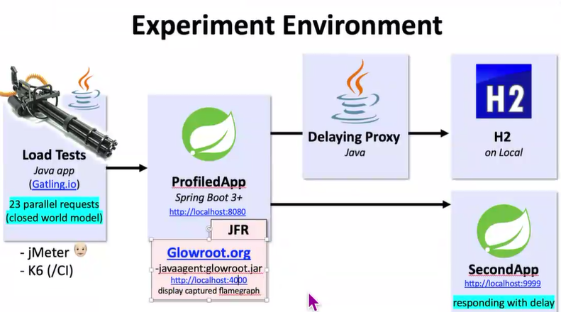

Steps:
   on
   https://github.com/victorrentea/performance-profiling
   Steps:
1) run StartDatabase.java
2) run StartDatabaseProxy.java = adds network latency between my local process and my local DB
3) run SecondApp.java
4) download
   https://github.com/glowroot/glowroot/releases/download/v0.14.0/glowroot-0.14.0-dist.zip
   unzip
   copy the path to glowroot.jar inside it
   eg: /Users/victorrentea/workspace/glowroot/glowroot.jar
   C:/down....../glowroot.jar
5) run ProfiledApp.java
   ! modify its run configuration to add VM args: -javaagent:<path-to-glowroot.jar>
   eg -javaagent:/Users/victorrentea/workspace/glowroot/glowroot.jar
   rerun ProfiledApp.java

6) run LoadTest.java

7) open the report in the console Flamegraph🔥🔥🔥 at http://localhost:4000/transaction/thread-flame-graph?transaction-type=Web
------------------------------------------------------------------------------------------------------------

# **Response time** ⬇️ = time from request to response.

Response time is good to be low. It is the time from the moment the request is sent to the moment the response is received. It is measured in milliseconds

When you say response time, you imply that there is an ongoing request that you have to respond to.

It is critical for synchronous calls for when someone waits for your response: eg: a rest API call, WSDL, SOAP, gRPC, etc.

Two types of actors: the client  (UI) and the server (SYSTEM) . 
The client sends a request to the server and waits for the response. 
The server receives the request, processes it, and sends back a response.
UI: Measured as **wall clock time**.
   - Disturbing users over ~2-3s : user experience is bad
   - UX: use Progressive Loading to make UI usable sooner
     example: show the first 10 items in a list, then load the rest
   - UI blocker (Loading ...): show a spinner + smarter waiting messages
     goal: avoid user refreshing the page (F5): smart waiting messages, progress bar%
SYSTEM: Measured as **CPU time**. Part of Service Level Agreement (SLA) and Key Performance Indicator (KPI).
   - Use percentiles 99th% = 50ms = means 99% of the requests are faster than < 50ms
   - Can ripple effect chained API calls: 1->2->3->4

# **Throughput** ⬆️ = number of requests per second.
means the speed that we process things, how many requests can the system handle per second. 
It is measured in requests per second (RPS).
= items/sec = transactions/sec -> DB (batch run time)  = hits/sec = queries/sec = calls/sec
= messages/sec -> MQ (message queue) = events/sec = tasks/sec = jobs/sec
= responses/sec -> API = pages/sec = views/sec = users/sec

# **Utilization** ⬆️ = % of time a resource is busy.
It is the percentage of time a resource is busy.
Usage Patterns:
   What endpoints are frequently called?
    What are the most common requests?
    What are the most common responses?

Resource Utilization:
   - CPU Utilization (Am i fully using the CPU?)
   - Memory Utilization (Am i fully using the memory?)   
   - Disk Utilization (Am i fully using the hardware?)
   - Network Utilization (auto-scaling down based on network traffic)